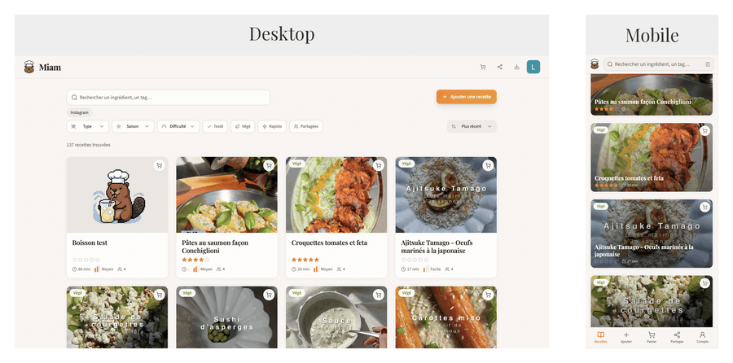
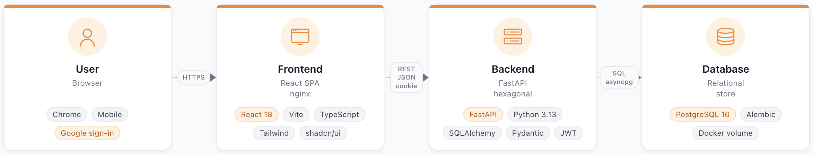

<div align="center">

# miam


**Write, save, and share recipes with the people you cook with.**

[](https://louisstefanuto.github.io/miam/)
[](https://codecov.io/gh/LouisStefanuto/miam)

[**Install**](#install) • [**Run**](#run) • [**Docs**](https://louisstefanuto.github.io/miam/) • [**Dev**](#dev)

Miam is an open-source recipe app. Self-hosted, mobile-friendly, and built around the way real kitchens work — from a screenshot on Instagram to a printable shopping list.



</div>

---

## Install

Install dependencies and setup virtual environment. Requires [`uv`](https://docs.astral.sh/uv/getting-started/installation/) installed.

```bash
make install
```

## Run

Launch project using `docker compose`.

```bash
make start
```

Stop project.

```bash
make stop
```

## Documentation

The project's documentation is available on [**GitHub Pages**](https://louisstefanuto.github.io/miam/).

To preview the documentation locally in real-time while editing, run:

```bash
make docs
```

## Architecture

### Stack



| Layer | Stack |
| --- | --- |
| **User** | Web browser · Google OAuth 2.0 · HttpOnly cookie session · HTTPS |
| **Frontend** | React 18 · Vite · TypeScript · Tailwind · shadcn/ui · React Router · served by nginx |
| **Backend** | FastAPI · Python 3.13 (uv) · SQLAlchemy 2 · Pydantic v2 · Hexagonal (ports/adapters) · Markdown & Word exporters |
| **Database** | PostgreSQL 16 · Alembic migrations · psycopg / asyncpg · Docker named volume |
| **Ops** | Docker Compose · Dozzle (container monitoring) · Locust (load testing) |

### Authentication flow

Miam uses **Google OAuth** for identity, then issues its own short-lived **JWT** stored as an **HttpOnly cookie**. An `Authorization: Bearer` header is accepted as a fallback for non-browser clients.

See the full [architecture diagram](./docs/docs/assets/images/architecture.html) and the [page about Authentication]() for details.


## Google SSO Setup

Authentication uses Google Sign-In. To configure it:

1. Go to [Google Cloud Console](https://console.cloud.google.com) and create a project (or use an existing one)
2. Navigate to **Google Auth Platform > Clients**, click **Create Client**, select **Web application**
3. Under **Authorized JavaScript origins**, add your frontend URL (e.g. `http://localhost:3000`)
4. Copy the **Client ID** and set it in both env files:

```env
# backend/.env
GOOGLE_CLIENT_ID=your-client-id.apps.googleusercontent.com

# frontend/.env
VITE_GOOGLE_CLIENT_ID=your-client-id.apps.googleusercontent.com
```

5. Go to **Google Auth Platform > Audience** and add your email under **Test users** (required while the app is in Testing mode)
6. Restart both frontend and backend

## Dev

Before pushing to this repo, please setup pre-commit.

```bash
uv tool install pre-commit
pre-commit install --hook-type commit-msg --hook-type pre-push
```

When running the project containers, monitor container resource usage with [Dozzle](https://dozzle.dev/guide/what-is-dozzle).

```bash
make dozzle
```

For performance results under load testing, see the [Locust section](./locust/README.md).
