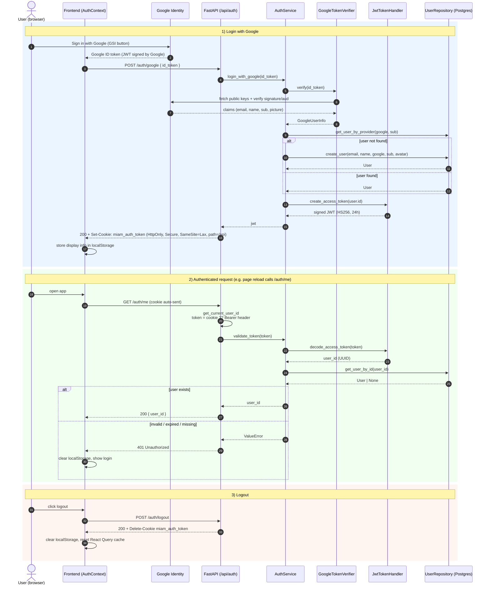

# Authentication

Miam uses **Google OAuth** for identity, then issues its own short-lived **JWT** stored as an **HttpOnly cookie**. An `Authorization: Bearer` header is accepted as a fallback for non-browser clients.

!!! note "How it works, in plain words"

    The core idea: **let Google handle "who are you?", and let our backend handle "what can you do here?"**

    When a user clicks "Sign in with Google", Google pops up its consent screen and hands the browser a signed token that proves "yes, this is `louis@example.com`". The frontend forwards that token to our backend. Our backend doesn't trust the browser, so it verifies the token directly against Google's public keys. Once verified, we either look up the user in our database or create them on the fly, then we mint **our own** session token — a JWT — and send it back as an HttpOnly cookie. From that point on, every API call automatically carries that cookie, and a single FastAPI dependency decodes it to figure out which user is making the request.

## Building blocks

| Layer | Component | Source |
| --- | --- | --- |
| Frontend | `AuthProvider` / `useAuth` | [`frontend/src/contexts/AuthContext.tsx`](https://github.com/LouisStefanuto/miam/blob/main/frontend/src/contexts/AuthContext.tsx) |
| API routes | `POST /auth/google`, `GET /auth/me`, `POST /auth/logout` | [`backend/src/miam/api/routes/auth.py`](https://github.com/LouisStefanuto/miam/blob/main/backend/src/miam/api/routes/auth.py) |
| Dependency | `get_current_user_id` (cookie / Bearer extraction) | [`backend/src/miam/api/deps.py`](https://github.com/LouisStefanuto/miam/blob/main/backend/src/miam/api/deps.py) |
| Domain service | `AuthService` (login + token validation) | [`backend/src/miam/domain/services.py`](https://github.com/LouisStefanuto/miam/blob/main/backend/src/miam/domain/services.py) |
| Google adapter | `GoogleTokenVerifier` | [`backend/src/miam/infra/google_auth.py`](https://github.com/LouisStefanuto/miam/blob/main/backend/src/miam/infra/google_auth.py) |
| JWT adapter | `JwtTokenHandler` (PyJWT, HS256) | [`backend/src/miam/infra/jwt_handler.py`](https://github.com/LouisStefanuto/miam/blob/main/backend/src/miam/infra/jwt_handler.py) |

The split follows the project's hexagonal architecture: `AuthService` only knows about ports (`GoogleTokenVerifierPort`, `JwtTokenPort`, `UserRepositoryPort`) — concrete adapters are wired in `deps.py`.

## Two token types

It is easy to confuse them:

- **Google ID token** — issued by Google in the browser, used **once** to prove identity to the backend.
- **App JWT** — minted by the backend (`sub = user_id`, 24 h expiry, HS256), used for **all subsequent calls**. The frontend never reads it; it lives in an HttpOnly cookie.

## Cookie settings

Set in [`auth.py`](https://github.com/LouisStefanuto/miam/blob/main/backend/src/miam/api/routes/auth.py):

```python
response.set_cookie(
    key="miam_auth_token",
    value=token,
    max_age=jwt_expiration_minutes * 60,
    httponly=True,
    secure=True,
    samesite="lax",
    path="/api",
)
```

## Sequence diagram



## Endpoints

### `POST /auth/google`

Exchange a Google ID token for an app JWT.

Request body:

```json
{ "id_token": "<google id token>" }
```

Response: `200` with `Set-Cookie: miam_auth_token=...` and a JSON body `{ "access_token": "..." }`. Returns `401` if the Google token is invalid or its email is not verified.

### `GET /auth/me`

Returns `{ "user_id": "<uuid>" }` if the cookie/Bearer token is valid, `401` otherwise. Used by the frontend on load to verify the session.

### `POST /auth/logout`

Clears the `miam_auth_token` cookie. Returns `{ "detail": "logged out" }`.

## Required environment variables

Loaded by `AuthSettings` from `.env`:

| Variable | Default | Description |
| --- | --- | --- |
| `JWT_SECRET_KEY` | — (required) | HMAC secret used to sign app JWTs |
| `JWT_ALGORITHM` | `HS256` | JWT signing algorithm |
| `JWT_EXPIRATION_MINUTES` | `1440` | Token + cookie lifetime in minutes |
| `GOOGLE_CLIENT_ID` | — (required) | OAuth client ID used to validate the `aud` claim of the Google ID token |
